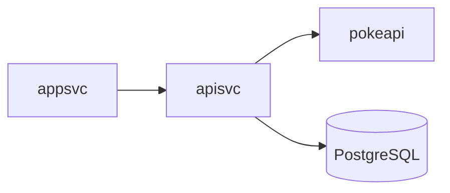
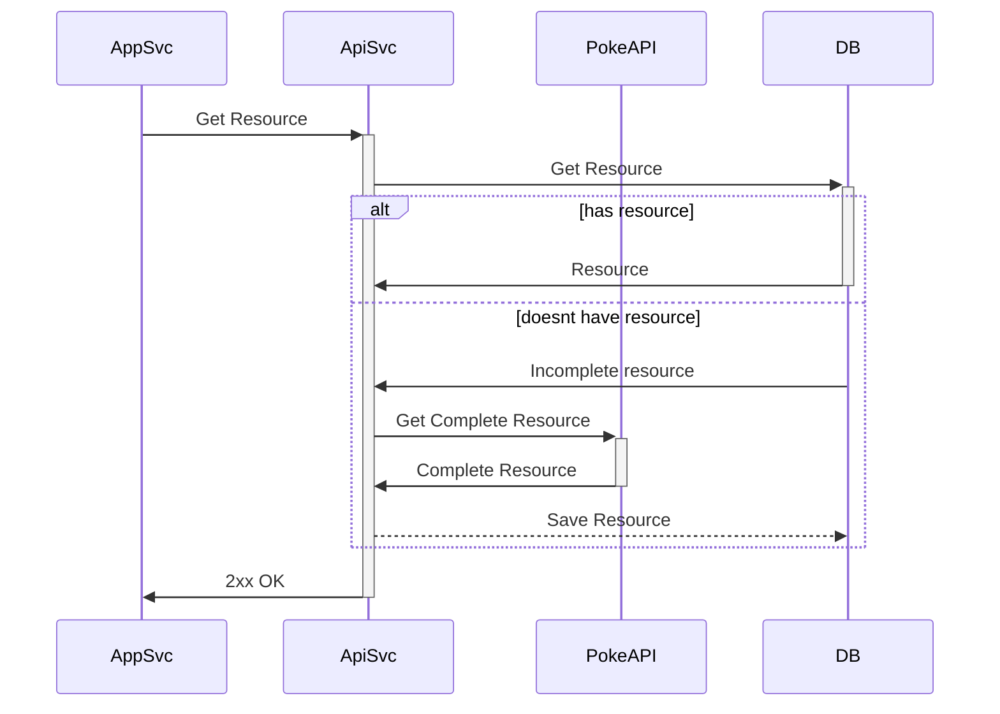

# PokeCLJ

This project is a challenge from [cljam](https://cljam.notion.site/Welcome-to-cljam-0b0459ae21e04128ae9220e03092136f).

Written and built with Clojure, Postgres and Docker/Compose.

## Setup

### Web App

TODO: write about.

### API Service

The API Service can use both an `.env` or a `profiles.clj` file. If you're in the development mode (REPL, lein run), I setted it to use the ``profiles.clj`` file, which looks something like this:

```clojure
{:dev {:env {:postgres-user ""
             :postgres-password ""
             :postgres-db ""
             :postgres-host ""
             :postgres-port 0000
             :sync-base-url "https://pokeapi.co/api/v2/"}}}
```

When built with `lein uberjar`, which is what the docker compose does, these should be setted through the `.env` file. The data we already setted there is ok, so we're done.

### Docker Compose

PokeCLJ uses docker-compose, so all you have to do is set the `.env` files. There is an example file `.env.example` which will guide you on the data to set, something like this:

```sh
POSTGRES_USER=user
POSTGRES_PASSWORD=password
POSTGRES_DB=my_db
POSTGRES_DATA=./mount/at/this/folder
POSTGRES_PORT=5432
```

## Running

Build and run the containers with

```sh
docker compose up
```

Now, you need to migrate the database. The migrations are at the folder `db/migrations`, so its just a matter of running:

```sh
docker compose --profile tools run --rm migrate up
```

## Software Architecture and Engineering decisions

At first, I'd like to highlight how gigantic the dataset this project works with is. PokeAPI is a huge collection of data about the Pokemon franchise, which is honestly not the main purpose of this project.

With that I mean, I don't want to show you I know how to handle big data; I want to show you I know how to organize and process data in order to build good and readable software, using industry standard Design Patterns, Architectural and Engineering Decisions.

For this reason, I shortened the spectrum of data this software works with to just the collections of Pokemons and their types; Nothing else. I hope you understand!

### Functional Requirements

This project don't seem to have many restrictions on engineering decisions, since the final user's pains aren't that specific. The person using this software would primarily be a Pokemon fan who just need to see some info about their favourite pokemons.

- List all pokemons
  - Pagination
- Search for pokemon
  - Filtering by id, name and types
- Search for types
  - Filtering by id, name and pokemons
- Pokemon portfolio (group pokemons arbitrarily)
- Favourites (List of about 5 to 10 based on user liking)

### Non Functional Requirements

- Data Integrity
  - Data should not be lost during usage
  - If lost, whatsoever, data should be recoverable
- Usability
  - The application should be simple and intuitive to use
  
### Tech Stack 

Based on the previous requirements, this is the Software stack I'll be working with:

| Tech           | Purpose          | Link                                      |
|----------------|------------------|-------------------------------------------|
| PostgreSQL     | Data Persistence | https://www.postgresql.org/               |
| Clojure/Script | Main Prog. Lang. | https://clojure.org/                      |
| Migrate        | DB Migration     | https://github.com/golang-migrate/migrate |
| Docker/Compose | Containerization | https://www.docker.com/                   |

These are not the only, each service has its own tech stack table, so I don't need to go in depth in only this README.

### Services

- **appsvc**: Takes care of user interaction, basically the frontend.
- **apisvc**: Takes care of integrating and processing the PokeAPI data, the DB, and the webapp as well.
- **db**: Persists data.

The following diagrams give an overview of how they communicate:

**Flowchart Diagram**



**Sequence Diagram**



# License

GPL 3.0, Josué Teodoro Moreira <teodoro.josue@pm.me> 2023
